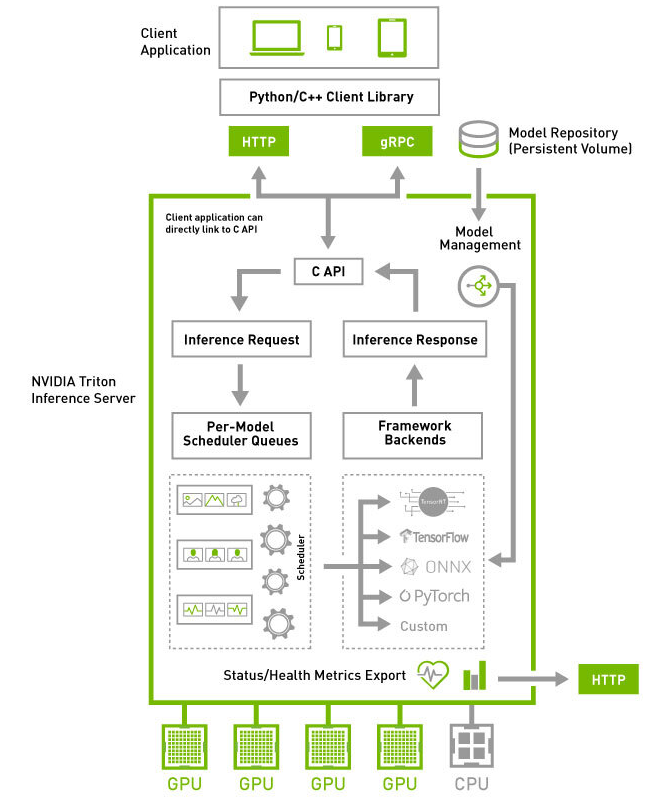

# NVIDIA Triton
NVIDIA Triton 서버는 오픈소스 소프트웨어로 제공되는 머신러닝 모델 inference 서버  
학습된 모델 파일을 model repository에 저장하면 개발자가 별도의 코드를 작성할 필요 없이 해당 모델을 추론 API 제작 가능  

citation  
https://developer.nvidia.com/ko-kr/nvidia-triton-inference-server  
https://peaceatlast.tistory.com/25



## Triton으로 모델을 서빙하기 위하여 개발자가 해야할 일
### 1. 서버를 세팅
### 2. Model repository를 생성, 서빙할 모델 파일들을 저장
### 3. Nvidia cloud에서 제공하는 Triton 서버 이미지를 서버에서 docker run
### 4. Triton 서버를 launch
### 5. Triton 서버에 추론 요청

## Model Repository layout
```
<model-repository-path>/
    <model-1-name>/
        [config.pbtxt]
        [<output-labels-file> ...]
        <version>/
            <model-definition-file>
        <version>/
            <model-definition-file>
        ...
    <model-2-name>/
        [config.pbtxt]
        [<output-labels-file> ...]
        <version>/
            <model-definition-file>
        <version>/
            <model-definition-file>
        ...
    ...
```
- 디렉토리 이름이 곧 모델명
- 각 모델 폴더 안에는 모델 version number를 이름으로 하는 폴더가 반드시 하나 이상 존재
> - TensorRT : model.plan
> - ONNX : model.onnx
> - Tensorflow : model.graphdef OR model.savedmodel 이름의 폴더
> - TorchScript : model.pt
> - Python : model.py

<b>ONNX 모델인 "model1", TensorFlow 모델인 "model2"와 Python 모델인 "model3"가 들어있는 예시 model repository의 layout</b>
```
<model-repository-path>/
    model1/
        config.pbtxt
        1/
            model.onnx
        2/
            model.onnx
    model2/
        config.pbtxt
        1/
            model.savedmodel/
            	saved_model.pb
                variables/
                	variables.index
                        variables.data-00000-of-00001
    model3/
    	config.pbtxt
        1/
        	model.py
        2/
        	model.py
        3/
        	model.py
```

## Model Management
Model repository에서 Triton 서버로 모델을 load하는 정책은 세가지
> NONE
>> Triton 서버를 launch할 때 model repository에 있는 모든 모델들을 load
>> 서버가 가동 중일 때는 model repository에 변경 사항이 생기거나 model management API로 요청을 보내도 무시  
>>  
>> ``` tritonserver --model-repository=<model-repository-path> --model-control-mode=none```  
>>   
>> .

> EXPLICIT
>> Triton 서버가 launch할 때 --load-model 옵션으로 명시된 모델들만 load  
>> Model repository에 있는 모든 모델들을 load하고 싶으면 --load-model=*  
>>  
>> ``` tritonserver --model-repository=<model-repository-path> --model-control-mode=explicit --load-model=model1 --load-model=model2```
>>   
>> 서버를 띄운 후에는 model management API를 이용하여 모델을 load/unload  
>> .

> POLL
>> 서버를 처음 launch할 때 model repository에 있는 모든 모델들을 load  
>> 서버는 주기적으로 model repository의 변경 사항을 감지하여 그에 따라 모델을 load/unload  
>> 주기는 --repository-poll-secs 옵션으로 설정  
>> Poll mode에서는 model management API를 사용 불가
>>  
>> ``` tritonserver --model-repository=<model-repository-path> --model-control-mode=poll --repository-poll-secs=60```
>>   
>> Poll mode의 경우 model repository의 변경 사항이 즉각 반영되지 않고 주기적으로 반영  
>> .


