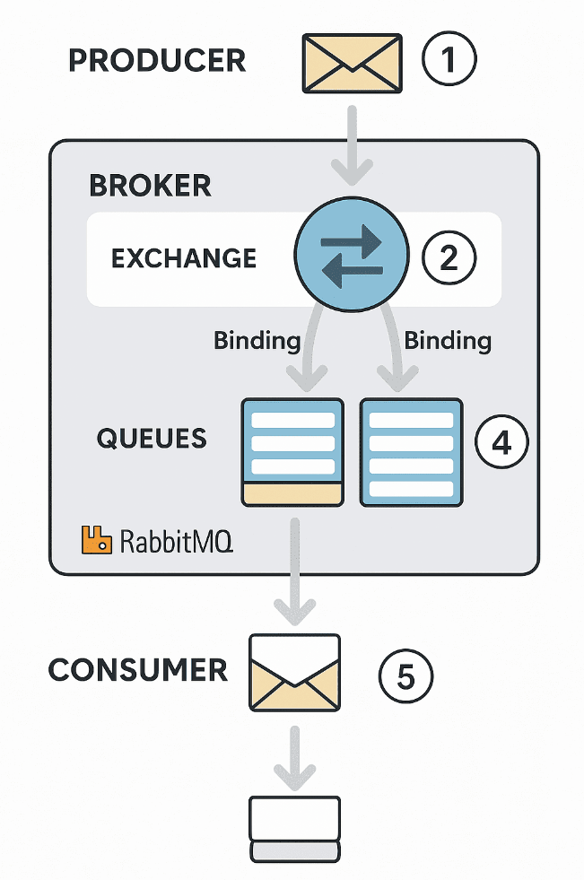

# RabbitMQ

###  개요
- RabbitMQ는 AMQP (Advanced Message Queuing Protocol) 을 구현한 대표적인 메시지 큐 시스템  
- 프로세스나 서비스 간에 데이터를 안전하고 효율적으로 전달하기 위해 메시지를 큐(Queue)에 저장하고, 이를 소비자(Consumer)가 처리하도록 설계  
### 주요 특징
- 비동기 처리: 메시지를 보낸 애플리케이션은 결과를 기다리지 않고 다른 작업을 계속 수행 가능
- 내결함성(Fault Tolerance): 메시지를 디스크에 저장하거나 클러스터링을 통해 장애 복구
- 확장성(Scalability): 여러 소비자와 큐를 통해 부하 분산 가능
- 플러그인 구조: 다양한 인증, 모니터링, 클러스터링 플러그인 제공
### 구성 요소
- Producer (생산자):	메시지를 생성하여 브로커(RabbitMQ)에 전달하는 주체
- Queue (큐):	메시지를 일시적으로 저장하는 버퍼 (FIFO 구조)
- Consumer (소비자):	큐로부터 메시지를 가져와 처리하는 주체
- Exchange (교환기):	메시지를 어떤 큐로 보낼지 결정하는 라우팅 엔진
- Binding (바인딩):	교환기와 큐를 연결하며, 라우팅 규칙을 정의
- Routing Key (라우팅 키):	메시지가 어느 큐로 가야 하는지를 결정하는 키 값
### 메세지 전달 과정
1. Producer 가 메시지를 Exchange 로 전송
2. Exchange 는 설정된 Binding Rule 과 Routing Key 를 기반으로 메시지를 특정 Queue 로 전달
3. Consumer 가 Queue 로부터 메시지를 받아 처리
4. 처리 완료 후 ACK (Acknowledgment) 신호를 브로커에 전송
5. ACK를 받으면 해당 메시지는 큐에서 제거됨
### Excahnge 타입
- Direct:	Routing Key가 정확히 일치하는 큐로 전달(ex.	routing_key = "task1" → "task1" 큐로 전달)
- Topic:	패턴 매칭(*, #)을 이용한 유연한 라우팅(ex. "logs.*" → logs.error, logs.info)
- Fanout:	모든 큐로 메시지를 브로드캐스트	(ex. 알림, 실시간 로그 전달)
- Headers	메시지 헤더 값으로 라우팅 (ex. 헤더 기반 조건 분기)  
  
 

